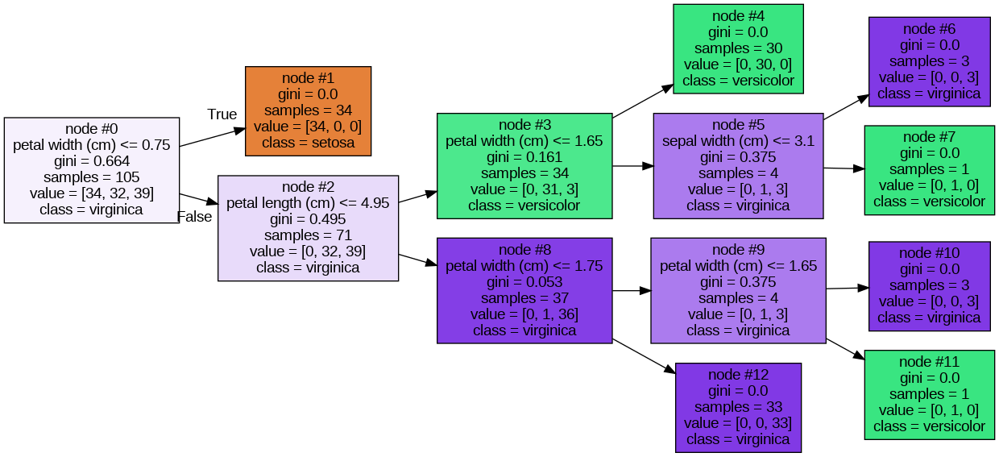

# Classification

1. 分類概要
2. 決定木の理論
3. 代表的な分類のアルゴリズム
4. 評価指標

---

## 1.分類概要
**分類**：カテゴリ（離散値）を予測すること

分類とは、（二次元の場合は）「カテゴリが異なる複数のデータを見分けることができる境界線を求めること」
- 一本の直線、平面、超平面で分けられることを**線形分離可能**、そのアルゴリズムは**線形分類器**と呼ばれる。
- 線形分離不可能な場合、そのアルゴリズムを**非線形分類器**と呼ぶ。


**線形分類器の例**
- 単純パーセプトロン
- **線形SVM**
- ロジスティック回帰

**非線形分類器の例**
- k-近傍法
- **決定木（分類木）**
- **ランダムフォレスト**
- 非線形SVM
- NN（ニューラルネットワーク）

---
## 2.決定木の理論
- 条件分岐を繰り返すことによって、分類を行う。
- 決定木では、各ノードでデータの「不純度」が低くなるように2つのグループに分割する。
- CART, CHAID, C5.0などがある。分岐、目的指標、分岐の指標が違う
    - CARTではジニ不純度,s CHAIDではカイ二乗統計量, C5.0では平均エントロピー（平均情報量）が使用される。
参考：<http://www.analyticsdlab.co.jp/column/decisiontree.html>

**Irisデータセットの例**

<https://free.kikagaku.ai/tutorial/basic_of_machine_learning/learn/machine_learning_classification>


**ジニ不純度（Gini's Impurity）とは**
- cf:ジニ係数（富の分配率を表す指数）
- 分岐されたノードの不純度を表す
- scikit-learnでは、CARTというアルゴリズムを使用。


**ジニ不純度の定式化**

$t$：ノード番号

$c$：ノードtの中のクラス数

$n_i$：クラス$i$に属するサンプル数

$n$；一つのノードに属する最大の数？

- クラス$i$に属するサンプルの割合$p(i|t)$は以下の式
$$
p(i|t) =\frac{n_i}{n}
$$
- ジニ不純度の定義は以下の式
$$
I_G(t) = 1 - \Sigma_{i=1}^c p(i|t)^2
$$


$G(k)$：あるノードkにおける不純度

$n$：ターゲットラベルの数

$p(i)$：あるノードkにおけるターゲットラベルiの頻度


- ジニ不純度の定義は以下の式
$$
G(k) = \Sigma_{i=1}^n p(i)(1-p(i))
$$

**ジニ不純度の例**

- 不純度が最も低い場合：「ノードtに単一のクラスしか入っていない」
    - $c$ = 1,$n_i$ = nであるので
$$
I_G(t) =1 - \Sigma_{i=1}^i \left(\frac{n}{n}\right)^2 = 0
$$


- 不純度が最も高い場合：「ノードt内のすべてのサンプルが異なるクラスであるとき」
    - $n$ = $c$,$n_i$ = 1であるので
$$
I_G(t) =1 - \Sigma_{i=1}^c \left(\frac{1}{c}\right)^2 = 1 - \frac{1}{c}
$$


参考：<https://qiita.com/murs313/items/0a2077f97664b58c2ea9>

**特徴量の重要度**

- ある特徴量で分割することでどれくらいジニ不純度を下げられるのか。
- ノードの不純度の減少分の重み付き和を決定木全体で平均した値
    - 重みはあるノードのにたどり着いたサンプル数の比率

```
The higher, the more important the feature. The importance of a feature is computed as the (normalized) total reduction of the criterion brought by that feature. It is also known as the Gini importance.
```

あるノードの不純度を$I(t_p)$、その左右の子ノードの不純度を$I(t_L)$、$I(t_R)$とする。
また、そのノードのサンプル数をそれぞれ$n_p$、$n_L$、$n_R$とする。$(n_p=n_L+n_R)$
このとき、ノード$t_P$の不純度の減少分の重み付き和は以下の式になる。

$$
\Delta I(t_P) = \frac{n_P}{N}I(t_P) - \frac{n_L}{N}I(t_L) - \frac{n_R}{N}I(t_R)
$$

求める特徴量重要度を$M(t_P)$とすると、以下の式のようになる。
$$
M(t_p) = \frac{\Delta I(t_P)}{\Sigma_P^{all nodes} \Delta I(t_P)}
$$


参考：
- <https://yolo-kiyoshi.com/2019/09/16/post-1226/>
- <http://taustation.com/decision-tree-feature-importance-calculation/>
- <https://qiita.com/H1dek1/items/72976f956d34d275d862>

--- 
## 3.その他のアルゴリズム
### 分類アルゴリズム一覧
#### 教師あり
- SVM（後述）
- 決定木（上述）
- ロジスティック回帰（後述）
- k最近傍法 (k-Nearest Neighbors, k-NN)
    - 未知と既知のデータ同士の距離を計算し、未知のデータが属するクラスを推定。
    - 近傍のデータによってクラスが決まる場合に使用。k-近傍への。計算が簡単。特徴量の数が少ない場合。
- ランダムフォレスト (Random Forests)
    - 複数の決定木モデルを組み合わせる。
    - 大規模・高次元なデータセットに使用。予測性能が高い。
- 勾配ブースティング決定木 (Gradient Boosting Trees)
    - 弱学習器を順にトレーニングし、前のモデルの予測誤差に対して重点的に学習させ性能を向上させる。
    - 予測性能が高い。予測性能を最大化するときに使用。
- ニューラルネットワーク (Neural Networks)

    - 非線形な関係性のモデリング、大量のデータによる学習効果、特徴抽出・次元削減に強い。多様なデータタイプに使用可能。

- ナイーブベイズ (Naive Bayes)
    - ベイズの定理を使用し、特徴量の条件付き確率を推定する.
    - 簡単・高速な実装。計算上の効率性。質的変数の扱いにも適する。

- アンサンブル学習法 (Ensemble Methods)
     - 複数の学習モデルを組み合わせて最終的な予測を行い、単一のモデルよりも高い予測性能を目指す。


#### **教師なし**
- 階層クラスタリング (Hierarchical Clustering)
    - 最初各点を個別のクラスタとして扱い類似度によって他のクラスタと徐々にマージし、ツリー構造で出力する。
    - 凝集型では徐々にマージしていき、分解型では徐々にスプリットする。
    - 階層構造により、クラスタ間の類似性や包含関係が明確になる。
    - ex:ウォード法（ward method）：各データの平方和を使用。

- 非階層クラスタリング（Non-Hierarchical Clustering）
    - データを指定した数のクラスタに分割する。
    - ex:k-means：1.クラスタの中心をランダムに選択, 2.最も近いものにデータを割り当てる, 3.クラスタの中心を再計算。

詳しい手法の説明は[割愛](https://qiita.com/tomomoto/items/b3fd1ec7f9b68ab6dfe2)…


### SVM
- 教師ありの分類器の一つ
- イメージは（パーセプトロン）＋（マージン最大化）＋（カーネル法）
- 境界線に最も近いサンプルとの距離（マージン）を最大化するように境界線を定義

- **カーネルトリック**を用いることによって、非線形分類が可能

**カーネルトリック**
カーネル関数を用いて高次元の特徴空間へデータを写像し、特徴空間上で線形分離を行う手法
ex:2次元のデータを2次元へ写像し、平面で線形分類


### ロジスティック回帰（線形分類器の例）
回帰を分類に適用したい。→結果を０〜１（確率）の形にする。
- シグモイド関数（ロジスティック関数）を使用し、目的変数$x$とその反応確率$p$を関係づける。
- 目的関数は、クロスエントロピーの形になる。

$$
z = \frac{1}{1 + \exp({-x})}
$$

$$
p(x) = \frac{1}{1+\exp(-(w_0 +w_{1}x))}
$$


---
## 4.評価指標

混同行列（Confusion Matrix）
- TP (True Positive、真陽性)：を正例として、その予測が正しい場合の数

- FP (False Positive、偽陽性)：予測値を正例として、その予測が誤りの場合の数

- TN (True Negative、真陰性)：予測値を負例として、その予測が正しい場合の数

- FN (False Negative、偽陰性)：予測値を負例として、その予測が誤りの場合の数


### Accuracy（正解率）
- 全ての判定のうち、予測が正しい割合
- 分類の精度指標として最も一般的

$$
Accuracy = \frac{TP+TN}{TP+FP+TN+FN} 
$$

### Precision（適合率）

- 予測したもののうち、その予測が正しい割合
- 偽陽性を制限するときに使用
    - ex:スパムメール検出時、正常なメールをスパムと判定しないようにする
$$
Precision = \frac{TP}{TP+FP}
$$


### Recall（再現率）

- 陽性のうち、正しく予測がされた割合
- 陽性の見逃しを避けたいときに使用
    - ex:誤って病気を見逃すことを避けたい場合

$$
Recall = \frac{TP}{TP+FN}
$$

### F1Score（F値）
- トレードオフの関係のPrecision・Recallのバランスをとるための指標
- Precision・Recallの調和平均の形で表される。

### 交差エントロピー誤差

- 誤差関数の一つ、値が小さいほどよい。
- 尤度関数の対数をとって、負の値にしたもの。
- ロジスティック回帰等で使われる。
- 確率的購買降下法（損失関数の最適化手法の一つ）との相性が良い
    - 自然対数の微分、$e^x$の微分計算が楽

$p$は真の確率分布、$q$は推定した確率分布。自然対数を使用。
参考

$$
H(p,q) = - \Sigma_x p(x)\log(q(x))
$$

- <https://www.anarchive-beta.com/entry/2020/06/17/180000>
- <https://www.kaggle.com/code/dansbecker/what-is-log-loss>

---


kaggle
- <https://www.kaggle.com/competitions/icr-identify-age-related-conditions/data>
- <https://scikit-learn.org/stable/modules/feature_selection.html#univariate-feature-selection>
- <https://scikit-learn.org/stable/modules/generated/sklearn.feature_selection.SelectKBest.html>

機械学習手法一覧
- <https://qiita.com/tomomoto/items/b3fd1ec7f9b68ab6dfe2>

次回までの課題
- 尤度関数とは
    - ロジスティック回帰との関係について
    - Odds Ratioと重みの関係について
    - 