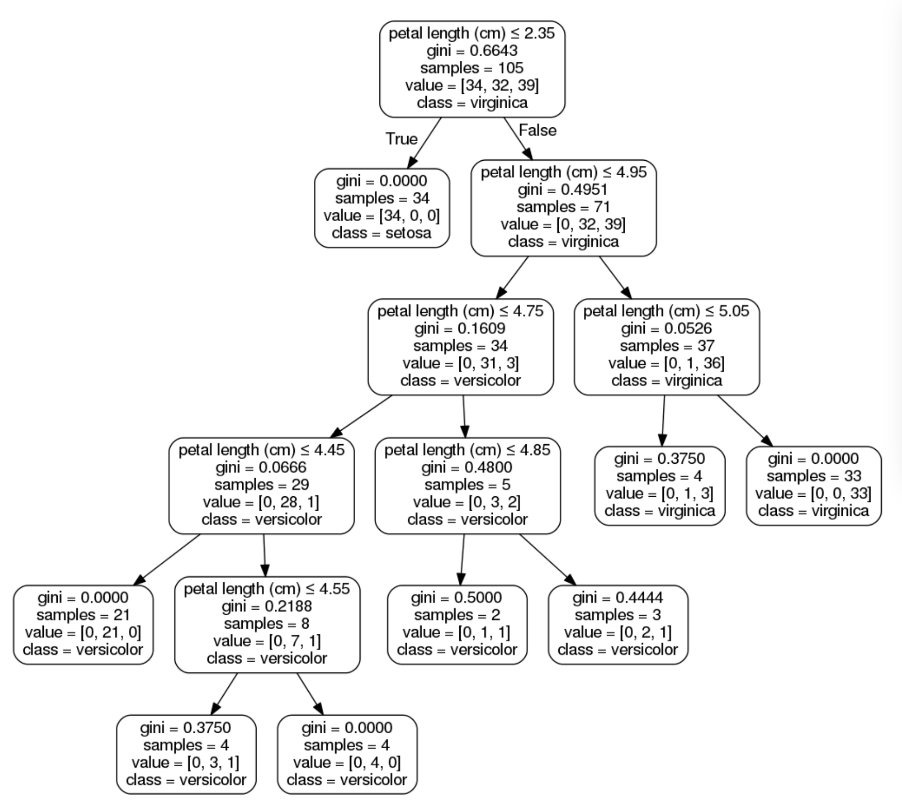

# Classification

1. 分類概要
2. 決定木の理論
3. 代表的な分類のアルゴリズム
4. 評価指標

---

## 1.分類概要
**分類**：カテゴリ（離散値）を予測すること

分類とは、（二次元の場合は）「カテゴリが異なる複数のデータを見分けることができる境界線を求めること」
- 一本の直線で分けられることを**線形分離可能**、そのアルゴリズムは**線形分類器**と呼ばれる。
- 直線を複数組み合わせて分類するとき、そのアルゴリズムを**非線形分類器**と呼ぶ。


**線形分類器の例**
- 単純パーセプトロン
- **線形SVM**
- ロジスティック回帰

**非線形分類器の例**
- k-近傍法
- **決定木（分類木）**
- **ランダムフォレスト**
- 非線形SVM
- NN（ニューラルネットワーク）

---
## 2.決定木の理論
- 条件分岐を繰り返すことによって、分類を行う。
- 決定木では、各ノードでデータの「不純度」が低くなるように2つのグループに分割する。

**Irisデータセットの例**

<https://free.kikagaku.ai/tutorial/basic_of_machine_learning/learn/machine_learning_classification>


**ジニ不純度（Gini's Impurity）とは**
- cf:ジニ係数（富の分配率を表す指数）
- 分岐されたノードの不純度を表す
- scikit-learnでは、CARTというアルゴリズムを使用。

**ジニ不純度の定式化**

$t$：ノード番号

$c$：ノードtの中のクラス数

$n_i$：クラス$i$に属するサンプル数

$n$；一つのノードに属する最大の数？

- クラス$i$に属するサンプルの割合$p(i|t)$は以下の式
$$
p(i|t) =\frac{n_i}{n}
$$
- ジニ不純度の定義は以下の式
$$
I_G(t) = 1 - \Sigma_{i=1}^c p(i|t)^2
$$


$G(k)$：あるノードkにおける不純度

$n$：ターゲットラベルの数

$p(i)$：あるノードkにおけるターゲットラベルiの頻度


- ジニ不純度の定義は以下の式
$$
G(k) = \Sigma_{i=1}^n p(i)(1-p(i))
$$

**ジニ不純度の例**

- 不純度が最も低い場合：「ノードtに単一のクラスしか入っていない」
    - $c$ = 1,$n_i$ = nであるので
$$
I_G(t) =1 - \Sigma_{i=1}^i \left(\frac{n}{n}\right)^2 = 0
$$


- 不純度が最も高い場合：「ノードt内のすべてのサンプルが異なるクラスであるとき」
    - $n$ = $c$,$n_i$ = 1であるので
$$
I_G(t) =1 - \Sigma_{i=1}^c \left(\frac{1}{c}\right)^2 = 1 - \frac{1}{c}
$$


参考：<https://qiita.com/murs313/items/0a2077f97664b58c2ea9>

**特徴量の重要度**

- ある特徴量で分割することでどれくらいジニ不純度を下げられるのか。
- ノードの不純度の減少分の重み付き和を決定木全体で平均した値
    - 重みはあるノードのにたどり着いたサンプル数の比率

```
The higher, the more important the feature. The importance of a feature is computed as the (normalized) total reduction of the criterion brought by that feature. It is also known as the Gini importance.
```

あるノードの不純度を$I(t_p)$、その左右の子ノードの不純度を$I(t_L)$、$I(t_R)$とする。
また、そのノードのサンプル数をそれぞれ$n_p$、$n_L$、$n_R$とする。$(n_p=n_L+n_R)$
このとき、ノード$t_P$の不純度の減少分の重み付き和は以下の式になる。

$$
\Delta I(t_P) = \frac{n_P}{N}I(t_P) - \frac{n_L}{N}I(t_L) - \frac{n_R}{N}I(t_R)
$$

求める特徴量重要度を$M(t_P)$とすると、以下の式のようになる。
$$
M(t_p) = \frac{\Delta I(t_P)}{\Sigma_P^{all nodes} \Delta I(t_P)}
$$


参考：
- <https://yolo-kiyoshi.com/2019/09/16/post-1226/>
- <http://taustation.com/decision-tree-feature-importance-calculation/>
- <https://qiita.com/H1dek1/items/72976f956d34d275d862>

--- 
## 3.代表的な分類のアルゴリズム

### SVM
- 教師ありの分類器の一つ
- イメージは（パーセプトロン）＋（マージン最大化）＋（カーネル法）
- 深層学習登場までは最強のアルゴリズムだったぽい
- 境界線に最も近いサンプルとの距離（マージン）を最大化するように境界線を定義

- **カーネルトリック**を用いることによって、非線形分類が可能

**カーネルトリック**
カーネル関数を用いて高次元の特徴空間へデータを写像し、特徴空間上で線形分離を行う手法
ex:2次元のデータを2次元へ写像し、平面で線形分類


### ロジスティック回帰（線形分類器の例）


---
## 4.評価指標

混同行列（Confusion Matrix）
- TP (True Positive、真陽性)：を正例として、その予測が正しい場合の数

- FP (False Positive、偽陽性)：予測値を正例として、その予測が誤りの場合の数

- TN (True Negative、真陰性)：予測値を負例として、その予測が正しい場合の数

- FN (False Negative、偽陰性)：予測値を負例として、その予測が誤りの場合の数

評価指標の種類

1. Accuracy（正解率）
- 全ての判定のうち、予測が正しい割合
- 分類の精度指標として最も一般的

$$
Accuracy = \frac{TP+TN}{TP+FP+TN+FN} 
$$

2. Precision（適合率）

- 予測したもののうち、その予測が正しい割合
- 誤診を少なくしたいときに使用
$$
Precision = \frac{TP}{TP+FP}
$$

3. Recall（再現率）

- 正例のうち、正しく予測がされた割合
- 正例の見逃しを避けたいときに使用
$$
Recall = \frac{TP}{TP+FN}
$$
4. F1Score（F値）
- トレードオフの関係のPrecision・Recallのバランスをとるための指標
- Precision・Recallの調和平均の形で表される。

5. クロスエントロピー

<https://www.anarchive-beta.com/entry/2020/06/17/180000>

次回までにやること
- クロスエントロピーの実際の計算方法
- 分類手法別の目的と仕組み
- 一部実装

kaggle
- <https://www.kaggle.com/competitions/icr-identify-age-related-conditions/data>